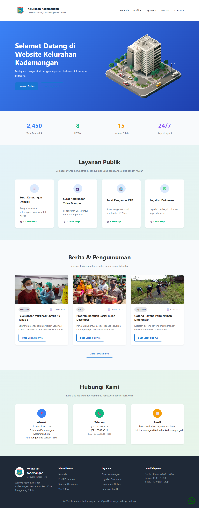
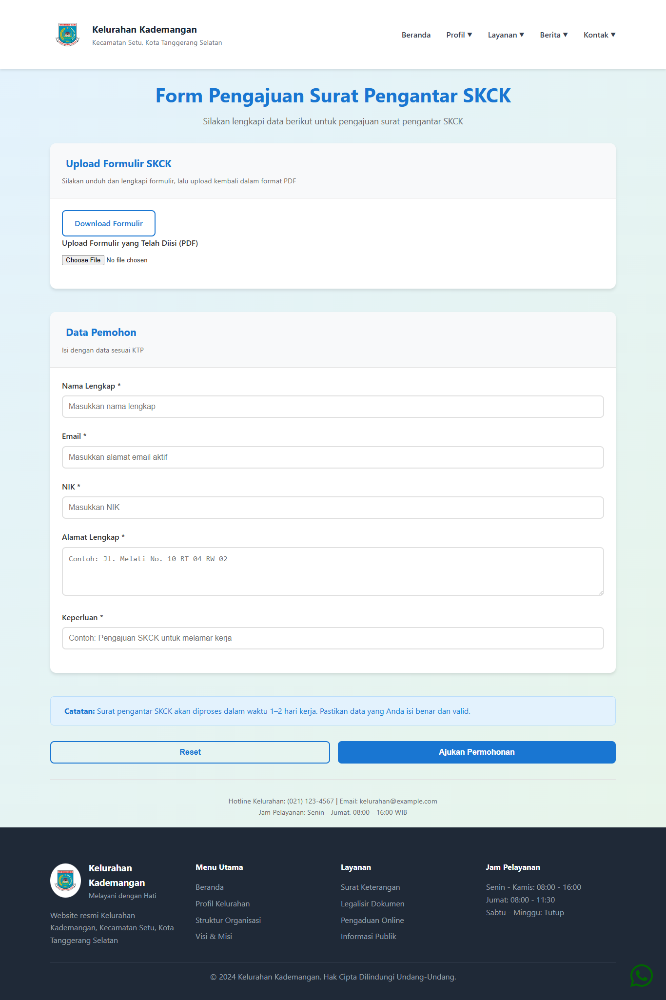
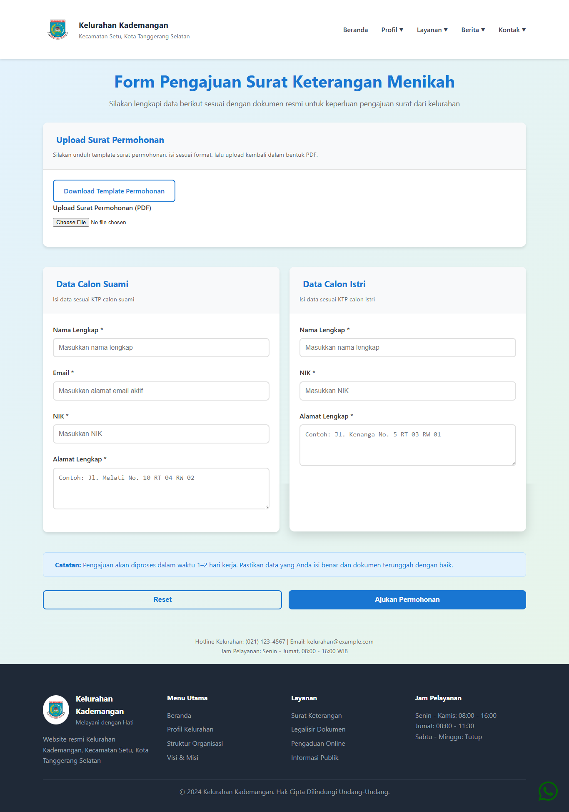
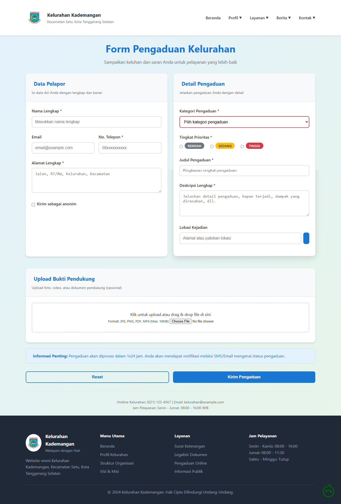
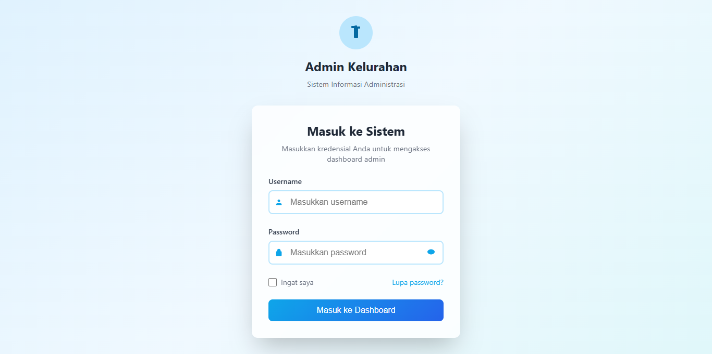
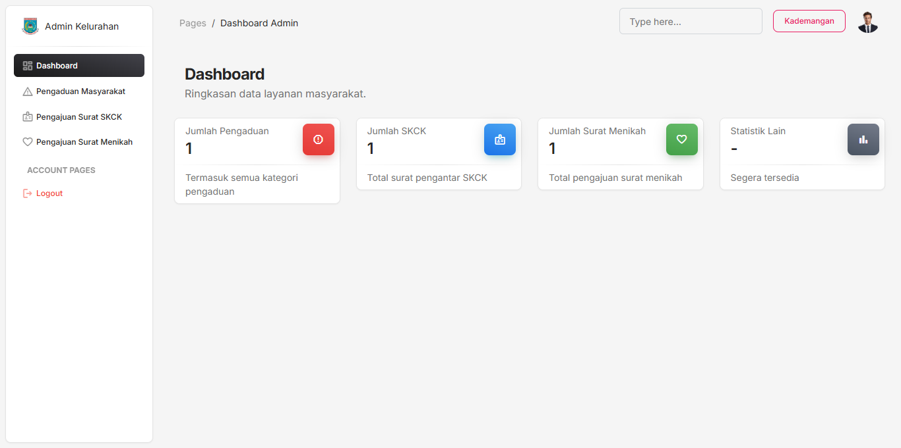
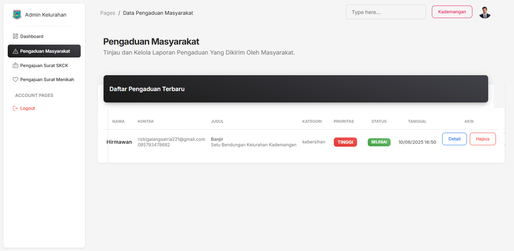

# Kelurahan Kademangan

Aplikasi web sederhana untuk layanan administrasi online di Kelurahan Kademangan.  
Dibangun menggunakan **CodeIgniter** (CI).

---

## 📌 Fitur

1. **Halaman Utama**

   - Menampilkan informasi umum dan akses ke fitur-fitur layanan kelurahan.

2. **Halaman Admin**

   - Login untuk admin kelurahan.
   - Manajemen data pengajuan & pengaduan.

3. **Fitur Layanan**
   - **Pengajuan Surat Pengantar SKCK**
   - **Pengajuan Surat Keterangan Menikah**
   - **Pengaduan Online**  
     Masyarakat dapat melakukan pengaduan secara online yang akan diterima oleh admin.

---

## 🚀 Cara Install

1. **Clone Repository**

   ```bash
   git clone https://github.com/username/kelurahan-kademangan.git
   ```

2. **Setting Environment**

   - Atur file konfigurasi database di `application/config/database.php` (CI 3) atau `.env` / `app/Config/Database.php` (CI 4).

3. **Jalankan Project**
   - Jika menggunakan XAMPP/Laragon, copy folder ke `htdocs`/`www`.
   - Akses melalui browser:
     ```
     http://localhost/kelurahan-kademangan
     ```

---

## 🗂️ Struktur Halaman

- `/` : Halaman utama/landing page.
- `/admin` : Halaman login dan dashboard admin.
- `/pengajuan-skck` : Form pengajuan surat pengantar SKCK.
- `/pengajuan-menikah` : Form pengajuan surat keterangan menikah.
- `/pengaduan-online` : Form pengaduan masyarakat.

---

## 🖼️ Preview Tampilan

### 🏠 Halaman Utama



### 📝 Form Pengajuan SKCK



### 💍 Form Pengajuan Surat Menikah



### 📣 Form Pengaduan Masyarakat



### 🔐 Login Admin



### 📊 Dashboard Admin



### 📋 Manajemen Pengaduan



---

## ⚠️ Catatan

- Pastikan PHP, MySQL/MariaDB sudah terinstall.
- File `.htaccess` harus aktif jika menggunakan fitur routing CI.
- Fitur dapat dikembangkan sesuai kebutuhan pemerintahan desa atau kelurahan lainnya.

---

## 📄 Lisensi

Project ini dikembangkan untuk kebutuhan internal Kelurahan Kademangan.  
Lisensi dan hak penggunaan dapat disesuaikan sesuai kebijakan setempat.
